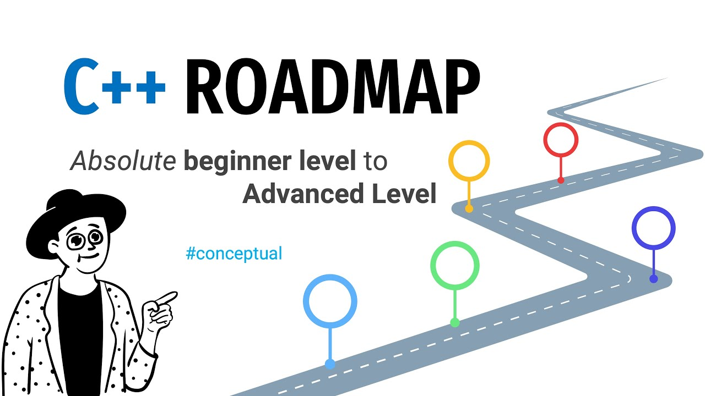

# Cpp_programming
## This repository  is about C++ language for me or anyone who sees it.  This will be my first steps for Robotics Engineering.  My Road-Maps for my dream:
### habr(rus version)(https://habr.com/ru/articles/986204/)
### w3schools(eng version)(https://www.w3schools.com/cpp/default.asp)
### roadmap(eng version)(https://roadmap.sh/cpp)

## Btw now I am a student and also here I will upload tasks from my Uni and secret tricks that professors teach me☺☺

---------------------------------------------
## [Level 1:](Level_1.md)
### Syntax, Input/Output, Operators, Variables, Data Types, Math, If/Else, Loops, Functions , Scopes
## (Level 2:](Level_2.md)
### Templates, String, Array, Enum, Memory Address, Pointers, Memory Management
## (Level 3:](Level_3.md)
### OOP, Class/Objects, Constructors, Structures, Polymorphism, Inheritance, Encapsulation, File Handlers, Errors
## (Level 4:](Level_4.md)
### DSA(Data Structure and Algorithms + STL(which stands for The Standard Template Library) -> vector, list, stack, queue, deque, set, map, iterators
## (Level 5:](Level_5.md)
### Namespaces, References
---------------------------------------------
